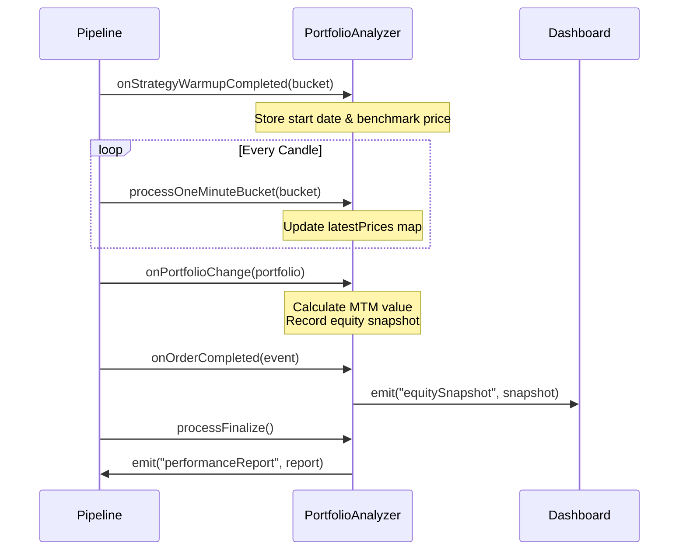

# Mark-to-Market Portfolio Performance Analyzer

## Overview

Migrate from transaction-based round-trip analysis to a portfolio Mark-to-Market (MTM) approach, enabling multi-asset performance tracking with a unified Numéraire (USDT).

### Problem Statement

The existing `RoundTripAnalyzer` relies on discrete buy/sell roundtrips to calculate performance. In a multi-asset portfolio (e.g., BTC/ETH, SOL/USDT), positions are never fully closed, and there is no single base currency. This prevents traditional performance calculation.

### Solution

1. **Pivot of calculation**: Move from transactional analysis to portfolio MTM valuation
2. **Unification**: Use a "Numéraire" (e.g., USDT) as the universal unit of account to aggregate all asset values at each timestamp
3. **Target metrics**: Generate a global Equity Curve to calculate Sharpe Ratio, Max Drawdown, and Alpha (vs Benchmark)

---

## Configuration Schema Changes

### Current Schema

```toml
[watch]
pairs = [{ symbol = "BTC/USDT" }, { symbol = "SOL/USDT" }]
```

### New Schema

```toml
[watch]
assets = ["BTC", "SOL", "ETH"]
currency = "USDT"
# Derived internally: pairs = ["BTC/USDT", "SOL/USDT", "ETH/USDT"]
```

### Implementation

Modify `watchSchema` in `src/services/configuration/configuration.schema.ts`:

```typescript
export const watchSchema = z
  .object({
    assets: assetsSchema,          // ["BTC", "SOL"]
    currency: currencySchema,      // "USDT"
    timeframe: z.enum(TIMEFRAMES),
    tickrate: z.number().default(1000),
    mode: z.enum(['realtime', 'backtest', 'importer']),
    warmup: warmupSchema,
    daterange: daterangeSchema.optional(),
    batchSize: z.number().optional(),
  })
  .transform((data) => ({
    ...data,
    // Derive pairs from assets × currency
    pairs: data.assets.map(asset => ({ 
      symbol: `${asset}/${data.currency}` as TradingPair 
    })),
  }))
  .superRefine((data, ctx) => {
    // existing validation...
  });
```

Update `src/models/schema/pairConfig.schema.ts`:

```typescript
export const assetSchema = z.custom<Asset>().refine(
  asset => asset && !asset.includes('/'),
  'Asset must not contain a slash'
);

export const currencySchema = z.custom<Asset>().refine(
  currency => currency && !currency.includes('/'),
  'Currency must not contain a slash'
);

export const assetsSchema = z
  .array(assetSchema)
  .min(1, 'At least one asset is required')
  .max(5, 'Maximum 5 assets allowed');
```

---

## Type Definitions

### EquitySnapshot

Location: `src/models/event.types.ts`

```typescript
export interface EquitySnapshot {
  /** Timestamp of the snapshot */
  date: EpochTimeStamp;
  /** Total portfolio value in Numéraire (e.g., USDT) */
  totalValue: number;
}
```

### Update all config file

Location: `config/*.yml`

```toml
watch:
  assets: ["BTC", "SOL"]
  currency: "USDT"
  ...
```

### PortfolioPerformanceReport

Location: `src/models/event.types.ts`

```typescript
export interface PortfolioPerformanceReport extends Report {
  id: 'PORTFOLIO PROFIT REPORT';
  /** Equity curve: array of snapshots */
  equityCurve: EquitySnapshot[];
  /** Maximum drawdown percentage (peak-to-trough) */
  maxDrawdownPct: number;
  /** Longest drawdown duration in milliseconds */
  longestDrawdownMs: number;
  /** Initial portfolio value in Numéraire */
  startEquity: number;
  /** Final portfolio value in Numéraire */
  endEquity: number;
  /** Total number of portfolio change events */
  portfolioChangeCount: number;
  /** Benchmark asset used for alpha calculation */
  benchmarkAsset: Asset;
}
```

### BalanceSnapshot

Location: `src/utils/finance/stats.utils.ts`

```typescript
export interface BalanceSnapshot {
  date: number;
  balance: { total: number };
}
```

---

## Plugin Architecture

### Directory Structure

```
src/plugins/analyzers/portfolioAnalyzer/
├── portfolioAnalyzer.ts          # Main plugin class
├── portfolioAnalyzer.types.ts    # Plugin-specific types
├── portfolioAnalyzer.const.ts    # Constants
└── portfolioAnalyzer.test.ts     # Unit tests
```

### Plugin Class

```typescript
export class PortfolioAnalyzer extends Plugin {
  // Configuration
  private readonly riskFreeReturn: number;
  private readonly benchmarkAsset: Asset;
  private readonly currency: Asset;

  // State
  private equityCurve: EquitySnapshot[] = [];
  private latestPrices: Map<TradingPair, number> = new Map();
  private startEquity: number = 0;
  private currentEquity: number = 0;
  private startBenchmarkPrice: number = 0;
  private endBenchmarkPrice: number = 0;
  private dates: { start: number; end: number } = { start: 0, end: 0 };
  private warmupCompleted: boolean = false;
  private portfolioChangeCount: number = 0;
}
```

### Event Handlers

| Event | Action |
|-------|--------|
| `onPortfolioChange` | Calculate total portfolio value in Numéraire, record equity snapshot |
| `onOrderCompleted` | Emit `equitySnapshot` event for live dashboards |
| `onStrategyWarmupCompleted` | Initialize benchmark price and start date |

### Portfolio Valuation Formula

```
Total Value = Currency Balance + Σ(Asset Balance × Asset Price)
```

- **Currency Balance**: Already in Numéraire (e.g., USDT)
- **Asset Balance × Price**: Convert each asset to Numéraire using latest candle close price

```typescript
private calculatePortfolioValue(portfolio: Portfolio): number {
  let totalValue = 0;

  // Currency is already in Numéraire
  const currencyBalance = getAssetBalance(portfolio, this.currency);
  totalValue += currencyBalance.total;

  // Convert each asset
  for (const asset of this.assets) {
    const assetBalance = getAssetBalance(portfolio, asset);
    const pair = `${asset}/${this.currency}` as TradingPair;
    const price = this.latestPrices.get(pair);

    if (price === undefined) {
      throw new Error(`Missing price for ${pair}`);
    }

    totalValue += assetBalance.total * price;
  }

  return totalValue;
}
```

### Benchmark Strategy

- **Benchmark**: Buy & Hold the first asset in `assets[]`
- **Alpha**: `Strategy Return % - Benchmark Return %`

```typescript
const benchmarkAsset = this.assets[0]; // e.g., "BTC"
const marketReturnPct = calculateMarketReturnPct(endBenchmarkPrice, startBenchmarkPrice);
const alpha = calculateAlpha(totalReturnPct, marketReturnPct);
```

---

## Metrics Calculation

All metrics reuse functions from `src/utils/finance/stats.utils.ts`:

| Metric | Function | Source |
|--------|----------|--------|
| Total Return % | `calculateTotalReturnPct()` | Current vs Start Equity |
| Annualized Return % | `calculateAnnualizedReturnPct()` | Total Return / Years |
| Alpha | `calculateAlpha()` | Strategy - Benchmark |
| Sharpe Ratio | `calculateSharpeRatio()` | Equity curve returns |
| Sortino Ratio | `calculateSortinoRatio()` | Equity curve returns |
| Max Drawdown | `calculateMaxDrawdown()` | Equity curve values |
| Longest Drawdown | `calculateLongestDrawdownDuration()` | Equity curve snapshots |

### Return Calculation

Returns are calculated from consecutive equity snapshots:

```typescript
private calculateReturns(equityValues: number[]): number[] {
  const returns: number[] = [];
  for (let i = 1; i < equityValues.length; i++) {
    const prev = equityValues[i - 1];
    if (prev > 0) {
      returns.push(((equityValues[i] - prev) / prev) * 100);
    }
  }
  return returns;
}
```

---

## Event Flow



---

## Configuration Options
Reuse the `src/plugins/analyzers/analyzer.schema.ts` schema

```typescript
// analyzer.schema.ts
export const analyzerSchema = z.object({
  name: z.string(),
  riskFreeReturn: z.number().default(5),        // 5% for crypto
  enableConsoleTable: z.boolean().default(false),
});
```

### Example Configuration

```toml
[[plugins]]
name = "PortfolioAnalyzer"
riskFreeReturn = 0
enableConsoleTable = true
```

---

## File Changes Summary

| File | Change Type | Description |
|------|-------------|-------------|
| `src/services/configuration/configuration.schema.ts` | MODIFY | Replace `pairs` with `assets` + `currency` |
| `src/models/schema/pairConfig.schema.ts` | MODIFY | Add `assetSchema`, `currencySchema`, `assetsSchema` |
| `src/models/event.types.ts` | MODIFY | Add `EquitySnapshot`, `PortfolioPerformanceReport` |
| `src/utils/finance/stats.utils.ts` | MODIFY | Add `BalanceSnapshot` interface |
| `src/constants/event.const.ts` | MODIFY | Add `EQUITY_SNAPSHOT_EVENT` |
| `src/plugins/analyzers/portfolioAnalyzer/*.ts` | NEW | Plugin implementation |
| `src/plugins/index.ts` | MODIFY | Export new plugin |

---

## Testing Strategy

### Unit Tests

1. **Portfolio valuation**: Verify MTM calculation with mixed asset balances
2. **Equity curve**: Test snapshot recording on portfolio changes
3. **Benchmark comparison**: Verify alpha calculation vs first asset
4. **Edge cases**: Empty portfolio, single asset, missing prices (should throw)

### Integration Tests

1. **Backtest run**: Multi-asset configuration with GridBot strategy
2. **Report validation**: Verify all `PortfolioPerformanceReport` fields populated
3. **Coexistence**: Run alongside `RoundTripAnalyzer` (single-pair mode)

---

## Breaking Changes

> **Warning**: The `watch.pairs` configuration property is replaced by `watch.assets` + `watch.currency`. All existing configuration files must be updated.

### Migration Example

**Before:**
```toml
[watch]
pairs = [{ symbol = "BTC/USDT" }]
```

**After:**
```toml
[watch]
assets = ["BTC"]
currency = "USDT"
```
