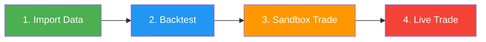

# 📋 Modes

Gekko 2 operates in three distinct modes, each designed for a specific stage of your trading workflow. Understanding these modes is essential for effectively developing, testing, and deploying your trading strategies.

---

## Overview

| Mode         | Purpose                              | Data Source     | Execution Speed | Risk Level |
|--------------|--------------------------------------|-----------------|-----------------|------------|
| **Importer** | Collect historical market data       | Live exchange   | API-limited     | None       |
| **Backtest** | Simulate strategies on past data     | Local database  | Ultra-fast      | None       |
| **Realtime** | Live market monitoring and trading   | Live exchange   | Real-time       | Variable   |

---

## 📥 Importer Mode

**Purpose:** Fetch and store historical candle data from cryptocurrency exchanges into a local database.

### When to Use

- Before running backtests (backtesting requires historical data)
- To update your local data with the latest market information
- When switching to a new trading pair or exchange
- To fill gaps in your existing data

### How It Works

1. Gekko connects to the specified exchange's public API
2. Requests historical candle data for the configured trading pair
3. Downloads candles in batches (respecting API rate limits)
4. Stores data in the local SQLite database for future use

### Configuration

```yaml
watch:
  asset: BTC
  currency: USDT
  mode: importer
  tickrate: 500              # Milliseconds between API requests (rate limiting)
  fillGaps: empty            # How to handle missing candles: 'empty' | 'no'
  daterange:
    start: '2024-01-01T00:00:00.000Z'
    end: '2024-12-01T00:00:00.000Z'

exchange:
  name: binance              # Exchange to fetch data from

storage:
  type: sqlite
  database: ./db/binance-BTC_USDT.sql

plugins:
  - name: CandleWriter       # Required: saves candles to database
```

### Key Configuration Options

| Option             | Description                  | Example Values       |
|--------------------|------------------------------|----------------------|
| `asset`            | The base asset to import     | `BTC`, `ETH`, `SOL`  |
| `currency`         | The quote currency           | `USDT`, `EUR`, `BTC` |
| `tickrate`         | Delay between API calls (ms) | `500` (recommended)  |
| `fillGaps`         | Handling of missing data     | `empty`, `no`        |
| `daterange.start`  | Start date for import        | ISO 8601 format      |
| `daterange.end`    | End date for import          | ISO 8601 format      |

### Important Notes

> [!IMPORTANT]
> The `CandleWriter` plugin is **required** for importer mode. Without it, fetched data will not be saved.

> [!NOTE]
> Import duration depends on the date range and exchange. Large ranges (multiple years) can take several minutes.

### Required Plugin

- **CandleWriter** — Saves imported candles to the configured database

---

## 📊 Backtest Mode

**Purpose:** Simulate trading strategies on historical data to evaluate performance without risking real money.

### When to Use

- Testing new strategy ideas
- Optimizing strategy parameters
- Comparing different strategies on the same data
- Validating strategy behavior before live deployment
- Analyzing performance metrics (profit/loss, drawdown, Sharpe ratio)

### How It Works

1. Gekko loads historical candles from the local database
2. Replays market data at high speed through your strategy
3. Simulates order execution via the `dummy-cex` exchange
4. Calculates comprehensive performance metrics
5. Outputs trade history and statistics

### Configuration

```yaml
watch:
  asset: BTC
  currency: USDT
  mode: backtest
  timeframe: 1h              # Candle timeframe for strategy
  warmup:
    candleCount: 365         # Candles needed before trading starts
  daterange:
    start: '2024-01-01T00:00:00.000Z'
    end: '2024-12-01T00:00:00.000Z'

exchange:
  name: dummy-cex            # Simulated exchange for backtesting

storage:
  type: sqlite
  database: ./db/binance-BTC_USDT.sql

strategy:
  name: RSI
  src: ohlc4                 # Price source: open, high, low, close, ohlc4, hlc3
  period: 21
  thresholds:
    high: 70
    low: 30
    persistence: 0

plugins:
  - name: TradingAdvisor     # Runs strategy and generates signals
    strategyName: RSI

  - name: Trader             # Executes simulated orders

  - name: PerformanceAnalyzer
    enableConsoleTable: true # Display results in terminal table
```

### Key Configuration Options

| Option               | Description                  | Example Values                      |
|----------------------|------------------------------|-------------------------------------|
| `timeframe`          | Candle period for strategy   | `1m`, `5m`, `15m`, `1h`, `4h`, `1d` |
| `warmup.candleCount` | Candles before trading       | `100`, `365`, `1000`                |
| `exchange.name`      | Must be `dummy-cex`          | `dummy-cex`                         |
| `strategy.name`      | Strategy to backtest         | `RSI`, `DEMA`, `GridBot`, etc.      |

### Important Notes

> [!IMPORTANT]
> Always use `dummy-cex` as the exchange for backtesting. This simulated exchange handles order execution without real API calls.

> [!TIP]
> Set `warmup.candleCount` based on your strategy's indicator requirements. For example, a 200-period moving average needs at least 200 warmup candles.

> [!NOTE]
> Backtesting runs at maximum speed — years of data can be processed in seconds.

### Typical Plugins

| Plugin                  | Purpose                                             |
|-------------------------|-----------------------------------------------------|
| **TradingAdvisor**      | Runs your strategy and generates buy/sell signals   |
| **Trader**              | Executes orders on the dummy exchange               |
| **PerformanceAnalyzer** | Calculates returns, drawdown, Sharpe ratio, etc.    |

### Performance Metrics

The PerformanceAnalyzer provides:
- **Total Return** — Overall profit/loss percentage
- **Max Drawdown** — Largest peak-to-trough decline
- **Longest Drawdown** — Duration of the longest drawdown period
- **Sharpe Ratio** — Risk-adjusted return
- **Win Rate** — Percentage of profitable trades
- **Trade Count** — Total number of executed trades

---

## 🔴 Realtime Mode

**Purpose:** Connect to live markets for real-time monitoring, alerts, paper trading, or live automated trading.

### When to Use

- Monitoring markets for trading signals (screener)
- Paper trading with exchange testnets (sandbox)
- Live trading with real funds
- Automated portfolio supervision and alerts

### How It Works

1. Gekko connects to the exchange's WebSocket or REST API
2. Receives real-time candle updates as they form
3. Runs your strategy on each new candle
4. Optionally executes orders based on strategy signals
5. Sends notifications via Telegram (if configured)

### Use Cases

Realtime mode supports several use cases depending on your plugin configuration:

#### 1. Screener (Alerts Only)

Monitor markets and receive Telegram alerts when your strategy signals — no trading executed.

```yaml
watch:
  asset: BTC
  currency: USDT
  mode: realtime
  timeframe: 4h
  warmup:
    candleCount: 365

exchange:
  name: binance

strategy:
  name: RSI
  period: 21
  thresholds:
    high: 70
    low: 30

plugins:
  - name: TradingAdvisor
    strategyName: RSI

  - name: EventSubscriber        # Telegram alerts
    token: YOUR_BOT_TOKEN
    botUsername: YOUR_BOT_USERNAME
```

#### 2. Sandbox Trading (Paper Money)

Test strategies with fake money on exchange testnets. Real orders are placed, but with virtual funds.

```yaml
watch:
  asset: BTC
  currency: USDT
  mode: realtime
  timeframe: 1d
  warmup:
    candleCount: 365

exchange:
  name: binance
  sandbox: true                  # Use testnet
  key: YOUR_SANDBOX_API_KEY
  secret: YOUR_SANDBOX_API_SECRET

strategy:
  name: DEMA
  period: 12
  thresholds:
    up: 100
    down: -150

plugins:
  - name: TradingAdvisor
    strategyName: DEMA

  - name: Trader                 # Executes orders on sandbox

  - name: PerformanceAnalyzer
    riskFreeReturn: 5
```

> [!TIP]
> Get Binance testnet API keys at: https://testnet.binance.vision/

#### 3. Live Trading (Real Money)

> [!CAUTION]
> **REAL MONEY AT RISK.** Only use live trading if you fully understand the risks and have thoroughly tested your strategy via backtesting and sandbox trading.

```yaml
watch:
  asset: BTC
  currency: USDT
  mode: realtime
  timeframe: 1h
  warmup:
    candleCount: 365

exchange:
  name: binance
  key: YOUR_LIVE_API_KEY
  secret: YOUR_LIVE_API_SECRET

strategy:
  name: DEMA
  period: 12
  thresholds:
    up: 100
    down: -150

plugins:
  - name: TradingAdvisor
    strategyName: DEMA

  - name: Trader

  - name: PerformanceAnalyzer
    riskFreeReturn: 5

  - name: EventSubscriber        # Get Telegram notifications
    token: YOUR_BOT_TOKEN
    botUsername: YOUR_BOT_USERNAME

[I understand that Gekko only automates MY OWN trading strategies]: true
```

#### 4. Supervision Mode

Monitor your bot's health with Telegram commands and receive system alerts.

```yaml
plugins:
  - name: Supervision
    token: YOUR_BOT_TOKEN
    botUsername: YOUR_BOT_SECRET
    cpuThreshold: 80             # Alert if CPU > 80%
    memoryThreshold: 1024        # Alert if memory > 1024 MB
    cpuCheckInterval: 10000      # Check every 10 seconds
    memoryCheckInterval: 10000
```

### Key Configuration Options

| Option             | Description                        | Values                              |
|--------------------|------------------------------------|-------------------------------------|
| `exchange.sandbox` | Use testnet instead of mainnet     | `true`, `false`                     |
| `exchange.key`     | API key for authenticated requests | Your API key                        |
| `exchange.secret`  | API secret for signing requests    | Your API secret                     |
| `timeframe`        | Live candle period                 | `1m`, `5m`, `15m`, `1h`, `4h`, `1d` |

### Important Notes

> [!WARNING]
> The line `[I understand that Gekko only automates MY OWN trading strategies]: true` is **required** for any configuration that executes real trades (sandbox or live). This confirms you understand that Gekko automates your strategy — it does not provide trading advice.

> [!IMPORTANT]
> Never share your API keys. Use environment variables or a secure secrets manager in production.

### Available Plugins for Realtime

| Plugin                  | Description                                             |
|-------------------------|---------------------------------------------------------|
| **TradingAdvisor**      | Runs strategy and generates signals                     |
| **Trader**              | Executes orders on the exchange                         |
| **PerformanceAnalyzer** | Tracks live performance metrics                         |
| **EventSubscriber**     | Sends trading events to Telegram                        |
| **Supervision**         | System monitoring and Telegram bot commands             |

---

## Mode Comparison

| Feature               | Importer      | Backtest     | Realtime         |
|-----------------------|---------------|--------------|------------------|
| Requires internet     | ✅ Yes        | ❌ No        | ✅ Yes           |
| Requires database     | ✅ Yes        | ✅ Yes       | ❌ Optional      |
| Required exchange     | Any supported | `dummy-cex`  | Any supported    |
| API keys needed       | ❌ No         | ❌ No        | 🔶 For trading   |
| Strategy required     | ❌ No         | ✅ Yes       | ✅ Yes           |
| Executes trades       | ❌ No         | ✅ Simulated | 🔶 Configurable  |
| Speed                 | API-limited   | Ultra-fast   | Real-time        |
| Risk                  | None          | None         | Low to High      |

---

## Workflow Recommendation

For the safest and most effective workflow, follow these steps:



1. **Import** historical data for your trading pair
2. **Backtest** your strategy to validate performance
3. **Sandbox trade** on a testnet to verify execution behavior
4. **Live trade** only after thorough testing and understanding of risks
