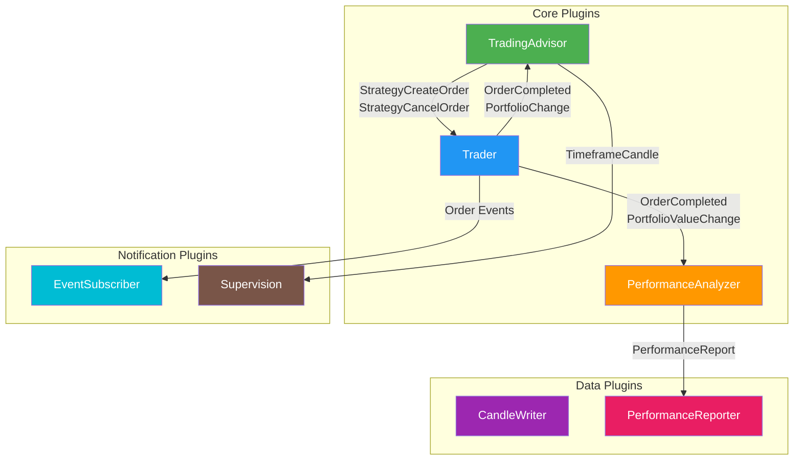

# 🔌 Plugins

Plugins are the modular components that extend Gekko 2's functionality. Each plugin handles a specific aspect of the trading workflow — from running strategies to executing orders, analyzing performance, and sending notifications. This guide provides detailed documentation for all available plugins.

---

## Overview

| Plugin                  | Purpose                                              | Mode Availability           |
|-------------------------|------------------------------------------------------|-----------------------------|
| **TradingAdvisor**      | Runs your strategy and generates trading signals     | Backtest, Realtime          |
| **Trader**              | Executes orders on exchanges                         | Backtest, Realtime          |
| **PerformanceAnalyzer** | Calculates performance metrics and statistics        | Backtest, Realtime          |
| **PerformanceReporter** | Exports backtest results to CSV files                | Backtest                    |
| **CandleWriter**        | Saves candle data to the database                    | Importer, Realtime          |
| **EventSubscriber**     | Sends trading events to Telegram                     | Realtime                    |
| **Supervision**         | System monitoring and Telegram bot commands          | Realtime                    |

---

## 📈 TradingAdvisor

**Purpose:** The TradingAdvisor is the central plugin that runs your trading strategy and generates buy/sell signals. It acts as the bridge between market data and your strategy logic.

### How It Works

1. Receives 1-minute candles from the market data stream
2. Batches candles into your configured timeframe (e.g., 1h, 4h, 1d)
3. Passes timeframe candles to your strategy
4. Relays strategy signals (create order, cancel order) to other plugins
5. Manages the strategy warmup period

### Configuration

```yaml
plugins:
  - name: TradingAdvisor
    strategyName: RSI          # Name of the strategy to run
    strategyPath: ./custom     # Optional: path to custom strategy file
```

### Configuration Reference

| Parameter       | Type     | Required | Default | Description                                       |
|-----------------|----------|----------|---------|---------------------------------------------------|
| `name`          | string   | Yes      | —       | Must be `TradingAdvisor`                          |
| `strategyName`  | string   | Yes      | —       | Name of the strategy to use                       |
| `strategyPath`  | string   | No       | —       | Path to custom strategy (for external strategies) |

### Events

**Listens to:**
- `OrderCompleted` — Notifies strategy when orders are filled
- `OrderCanceled` — Notifies strategy when orders are canceled
- `OrderErrored` — Notifies strategy when orders fail
- `PortfolioChange` — Updates strategy with current portfolio state

**Emits:**
- `StrategyCreateOrder` — Signal to create a new order
- `StrategyCancelOrder` — Signal to cancel an existing order
- `StrategyInfo` — Informational messages from the strategy
- `StrategyWarmupCompleted` — Indicates warmup period has ended
- `TimeframeCandle` — Batched candle for the configured timeframe

### Dependencies

- Requires **exchange** injection for market data access

> [!IMPORTANT]
> The TradingAdvisor is required for any mode that involves running a strategy (backtest or realtime trading).

---

## 💹 Trader

**Purpose:** The Trader plugin executes orders on exchanges. It bridges the gap between strategy signals and actual order placement — whether on a live exchange, sandbox, or simulated dummy exchange.

### How It Works

1. Receives order signals from the TradingAdvisor
2. Validates orders against current portfolio and market conditions
3. Submits orders to the configured exchange
4. Monitors order status and handles fills/cancellations
5. Emits portfolio updates after order execution

### Configuration

```yaml
plugins:
  - name: Trader
```

### Configuration Reference

| Parameter | Type   | Required | Default | Description            |
|-----------|--------|----------|---------|------------------------|
| `name`    | string | Yes      | —       | Must be `Trader`       |

### Events

**Listens to:**
- `StrategyCreateOrder` — Receives new order requests from strategy
- `StrategyCancelOrder` — Receives cancel requests from strategy
- `StrategyWarmupCompleted` — Activates trading after warmup

**Emits:**
- `OrderInitiated` — Order has been submitted to exchange
- `OrderCompleted` — Order has been fully filled
- `OrderCanceled` — Order has been canceled
- `OrderErrored` — Order execution failed
- `OrderPartiallyFilled` — Order has been partially executed
- `OrderStatusChanged` — Order status has changed
- `PortfolioChange` — Portfolio balances have changed
- `PortfolioValueChange` — Portfolio value has changed

### Dependencies

- Requires **exchange** injection for order execution

### Order Types

The Trader supports multiple order types depending on your strategy:

| Order Type | Description                                      |
|------------|--------------------------------------------------|
| `MARKET`   | Execute immediately at current market price      |
| `LIMIT`    | Execute at specified price or better             |

### Exchange Modes

| Exchange      | Description                                    | Risk Level |
|---------------|------------------------------------------------|------------|
| `dummy-cex`   | Simulated exchange for backtesting             | None       |
| Sandbox       | Exchange testnet with virtual funds            | None       |
| Live          | Real exchange with real funds                  | High       |

> [!CAUTION]
> When using the Trader with a live exchange, real money is at risk. Always test thoroughly with backtesting and sandbox trading first.

---

## 📊 PerformanceAnalyzer

**Purpose:** The PerformanceAnalyzer tracks and calculates comprehensive performance metrics for your trading strategy. It provides insights into profitability, risk, and overall strategy effectiveness.

### How It Works

1. Tracks portfolio value changes throughout the trading session
2. Records all completed trades and their outcomes
3. Monitors market exposure (time spent in positions)
4. Calculates risk-adjusted returns at session end
5. Outputs detailed performance report

### Configuration

```yaml
plugins:
  - name: PerformanceAnalyzer
    riskFreeReturn: 5          # Annual risk-free rate (%)
    enableConsoleTable: true   # Display results in terminal
```

### Configuration Reference

| Parameter           | Type    | Required | Default | Description                       |
|---------------------|---------|----------|---------|-----------------------------------|
| `name`              | string  | Yes      | —       | Must be `PerformanceAnalyzer`     |
| `riskFreeReturn`    | number  | No       | `5`     | Annual risk-free return rate (%)  |
| `enableConsoleTable`| boolean | No       | `false` | Display results as terminal table |

### Events

**Listens to:**
- `PortfolioValueChange` — Tracks balance samples for drawdown calculation
- `PortfolioChange` — Updates current portfolio state
- `StrategyWarmupCompleted` — Records starting conditions
- `OrderCompleted` — Logs trade details for analysis

**Emits:**
- `PerformanceReport` — Final performance statistics

### Performance Metrics

The PerformanceAnalyzer calculates the following metrics:

| Metric                    | Description                                                      |
|---------------------------|------------------------------------------------------------------|
| **Total Return**          | Overall profit/loss as a percentage                              |
| **Market Return**         | Buy-and-hold performance over the same period                    |
| **Alpha**                 | Excess return compared to market                                 |
| **Yearly Profit**         | Annualized profit in quote currency                              |
| **Exposure**              | Percentage of time spent in positions                            |
| **Sharpe Ratio**          | Risk-adjusted return (higher is better)                          |
| **Sortino Ratio**         | Downside risk-adjusted return                                    |
| **Standard Deviation**    | Volatility of returns                                            |
| **Max Drawdown**          | Largest peak-to-trough decline                                   |
| **Longest Drawdown**      | Duration of the longest drawdown period                          |
| **Trade Count**           | Total number of executed trades                                  |

### Understanding the Metrics

> [!TIP]
> **Sharpe Ratio Interpretation:**
> - Below 1.0: Suboptimal risk-adjusted returns
> - 1.0 - 2.0: Good risk-adjusted performance
> - 2.0 - 3.0: Very good performance
> - Above 3.0: Excellent (rare in real trading)

> [!NOTE]
> The `riskFreeReturn` parameter is used in Sharpe and Sortino ratio calculations. Adjust this based on current treasury rates or your opportunity cost of capital.

---

## 📋 PerformanceReporter

**Purpose:** The PerformanceReporter exports backtest results to CSV files, enabling easy comparison across multiple backtest runs and external analysis.

### How It Works

1. Receives performance reports from the PerformanceAnalyzer
2. Generates a unique strategy identifier based on configuration
3. Appends results to a CSV file with thread-safe locking
4. Creates the output directory and file if they don't exist

### Configuration

```yaml
plugins:
  - name: PerformanceReporter
    filePath: ./reports        # Directory for CSV output
    fileName: backtest.csv     # Output filename
```

### Configuration Reference

| Parameter  | Type   | Required | Default                   | Description                     |
|------------|--------|----------|---------------------------|---------------------------------|
| `name`     | string | Yes      | —                         | Must be `PerformanceReporter`   |
| `filePath` | string | No       | Current working directory | Directory for output file       |
| `fileName` | string | No       | `performance_reports.csv` | Name of the output CSV file     |

### Events

**Listens to:**
- `PerformanceReport` — Receives final performance statistics

### CSV Output Format

The CSV file contains the following columns:

| Column                   | Description                                  |
|--------------------------|----------------------------------------------|
| `id`                     | Unique strategy configuration identifier     |
| `pair`                   | Trading pair (e.g., BTC/USDT)                |
| `start time`             | Backtest start timestamp                     |
| `end time`               | Backtest end timestamp                       |
| `duration`               | Total duration of backtest                   |
| `exposure`               | Time spent in positions (%)                  |
| `start price`            | Asset price at start                         |
| `end price`              | Asset price at end                           |
| `market`                 | Buy-and-hold return (%)                      |
| `alpha`                  | Excess return vs market (%)                  |
| `yearly profit`          | Annualized profit with percentage            |
| `total orders`           | Number of trades executed                    |
| `original balance`       | Starting balance                             |
| `current balance`        | Ending balance                               |
| `sharpe ratio`           | Risk-adjusted return metric                  |
| `sortino ratio`          | Downside risk-adjusted return                |
| `standard deviation`     | Return volatility                            |
| `max drawdown`           | Maximum drawdown (%)                         |
| `longest drawdown`       | Duration of longest drawdown                 |

> [!TIP]
> Use the PerformanceReporter when running multiple backtests with different parameters. The CSV format makes it easy to analyze results in spreadsheet software or import into data analysis tools.

---

## 💾 CandleWriter

**Purpose:** The CandleWriter saves candle data to the configured database. It's essential for the Importer mode and optional for Realtime mode if you want to persist incoming market data.

### How It Works

1. Receives 1-minute candles from the pipeline
2. Buffers candles in memory for efficiency
3. Writes candles to the database in batches
4. Flushes remaining candles on finalization

### Configuration

```yaml
plugins:
  - name: CandleWriter
```

### Configuration Reference

| Parameter | Type   | Required | Default | Description             |
|-----------|--------|----------|---------|-------------------------|
| `name`    | string | Yes      | —       | Must be `CandleWriter`  |

### Dependencies

- Requires **storage** injection for database access

### Mode Usage

| Mode      | Required | Purpose                                        |
|-----------|----------|------------------------------------------------|
| Importer  | Yes      | Store fetched historical candles               |
| Realtime  | No       | Optionally persist live candles for later use  |

> [!IMPORTANT]
> The CandleWriter is **required** for Importer mode. Without it, fetched historical data will not be saved to the database.

---

## 📱 EventSubscriber

**Purpose:** The EventSubscriber sends trading events to Telegram, keeping you informed about strategy signals, order executions, and trading activity in real-time.

### How It Works

1. Connects to Telegram Bot API using your bot token
2. Listens for commands to manage event subscriptions
3. Filters events based on your active subscriptions
4. Sends formatted messages for relevant trading events

### Configuration

```yaml
plugins:
  - name: EventSubscriber
    token: YOUR_TELEGRAM_BOT_TOKEN
    botUsername: YOUR_BOT_USERNAME
```

### Configuration Reference

| Parameter    | Type   | Required | Default | Description                       |
|--------------|--------|----------|---------|-----------------------------------|
| `name`       | string | Yes      | —       | Must be `EventSubscriber`         |
| `token`      | string | Yes      | —       | Telegram Bot API token            |
| `botUsername`| string | Yes      | —       | Your Telegram bot's username      |

### Events

**Listens to:**
- `StrategyInfo` — Strategy log messages
- `StrategyCreateOrder` — New order signals from strategy
- `OrderInitiated` — Orders submitted to exchange
- `OrderCanceled` — Canceled orders
- `OrderErrored` — Failed orders
- `OrderCompleted` — Filled orders

### Telegram Commands

Control your subscriptions via Telegram commands:

| Command                   | Description                                |
|---------------------------|--------------------------------------------|
| `/help`                   | Show all available commands                |
| `/subscribe_to_all`       | Subscribe to all event types               |
| `/unsubscribe_from_all`   | Unsubscribe from all events                |
| `/subscriptions`          | List current active subscriptions          |
| `/subscribe_to_<event>`   | Toggle subscription for specific event     |

### Available Event Types

| Event Type        | Description                              |
|-------------------|------------------------------------------|
| `strategy_info`   | Strategy log messages and debug info     |
| `strategy_advice` | New order signals from strategy          |
| `order_initiated` | Order submitted to exchange              |
| `order_canceled`  | Order cancellation confirmed             |
| `order_errored`   | Order execution failed                   |
| `order_completed` | Order fully executed                     |

### Example Notifications

**Order Completed:**
```
BUY MARKET order completed (abc-123-def)
Amount: 0.5 BTC
Price: 42,500 USDT
Fee percent: 0.1%
Fee: 21.25 USDT
At time: 2024-01-15T14:30:00.000Z
Current portfolio: 0.5 BTC / 47,500 USDT
Current balance: 68,750 USDT
```

> [!TIP]
> Create a Telegram bot by messaging [@BotFather](https://t.me/BotFather) and following the instructions. Keep your token secure!

---

## 🔧 Supervision

**Purpose:** The Supervision plugin provides system monitoring and health checks via Telegram. It alerts you when resource usage exceeds thresholds and allows you to control monitoring remotely.

### How It Works

1. Connects to Telegram Bot API for command/response interaction
2. Monitors CPU and memory usage at configurable intervals
3. Sends alerts when thresholds are exceeded
4. Validates candle data against exchange for accuracy
5. Monitors application logs and forwards warnings/errors

### Configuration

```yaml
plugins:
  - name: Supervision
    token: YOUR_TELEGRAM_BOT_TOKEN
    botUsername: YOUR_BOT_USERNAME
    cpuThreshold: 80              # Alert if CPU > 80%
    memoryThreshold: 1024         # Alert if memory > 1024 MB
    cpuCheckInterval: 10000       # Check CPU every 10 seconds
    memoryCheckInterval: 10000    # Check memory every 10 seconds
    logMonitoringInterval: 60000  # Check logs every 60 seconds
```

### Configuration Reference

| Parameter              | Type   | Required | Default | Description                            |
|------------------------|--------|----------|---------|----------------------------------------|
| `name`                 | string | Yes      | —       | Must be `Supervision`                  |
| `token`                | string | Yes      | —       | Telegram Bot API token                 |
| `botUsername`          | string | Yes      | —       | Your Telegram bot's username           |
| `cpuThreshold`         | number | No       | `80`    | CPU usage alert threshold (%)          |
| `memoryThreshold`      | number | No       | `1024`  | Memory usage alert threshold (MB)      |
| `cpuCheckInterval`     | number | No       | `10000` | CPU check interval (milliseconds)      |
| `memoryCheckInterval`  | number | No       | `10000` | Memory check interval (milliseconds)   |
| `logMonitoringInterval`| number | No       | `60000` | Log monitoring interval (milliseconds) |

### Events

**Listens to:**
- `TimeframeCandle` — Validates candles against exchange data

### Telegram Commands

Control monitoring via Telegram commands:

| Command                      | Description                               |
|------------------------------|-------------------------------------------|
| `/healthcheck`               | Check if Gekko is running                 |
| `/launchcpucheck`            | Start CPU monitoring                      |
| `/stopcpucheck`              | Stop CPU monitoring                       |
| `/launchmemorycheck`         | Start memory monitoring                   |
| `/stopmemorycheck`           | Stop memory monitoring                    |
| `/launchtimeframecandlecheck`| Start candle validation                   |
| `/stoptimeframecandlecheck`  | Stop candle validation                    |
| `/startlogmonitoring`        | Start log monitoring (warns/errors)       |
| `/stoplogmonitoring`         | Stop log monitoring                       |

### Monitoring Features

| Feature               | Description                                              |
|-----------------------|----------------------------------------------------------|
| **Health Check**      | Verify the bot process is running                        |
| **CPU Monitoring**    | Alert when CPU usage exceeds threshold                   |
| **Memory Monitoring** | Alert when memory usage exceeds threshold                |
| **Candle Validation** | Compare local candles with exchange data for accuracy    |
| **Log Monitoring**    | Forward warning and error logs to Telegram               |

### Example Alerts

**CPU Alert:**
```
⚠️ CPU usage exceeded: 85.42%
```

**Memory Alert:**
```
⚠️ Memory usage exceeded: 1156.78 MB
```

**Candle Mismatch:**
```
⚠️ Timeframe candle mismatch detected:
close: 42500 | 42498
volume: 1234.5 | 1234.7
```

> [!NOTE]
> The Supervision plugin is designed for production deployments where monitoring bot health is critical. For development and testing, it's typically not needed.

### Dependencies

- Requires **exchange** injection for candle validation feature

---

## Plugin Dependencies

Understanding plugin dependencies helps you configure the correct combination for your use case.

### Dependency Graph



---

## Recommended Plugin Combinations

### Importer Mode

```yaml
plugins:
  - name: CandleWriter    # Required to save candles
```

### Backtest Mode

```yaml
plugins:
  - name: TradingAdvisor
    strategyName: YourStrategy

  - name: Trader

  - name: PerformanceAnalyzer
    enableConsoleTable: true

  - name: PerformanceReporter    # Optional: export to CSV
    filePath: ./reports
```

### Realtime Screener (Alerts Only)

```yaml
plugins:
  - name: TradingAdvisor
    strategyName: RSI

  - name: EventSubscriber
    token: YOUR_TOKEN
    botUsername: YOUR_BOT
```

### Realtime Trading

```yaml
plugins:
  - name: TradingAdvisor
    strategyName: DEMA

  - name: Trader

  - name: PerformanceAnalyzer
    riskFreeReturn: 5

  - name: EventSubscriber       # Notifications
    token: YOUR_TOKEN
    botUsername: YOUR_BOT

  - name: Supervision           # Health monitoring
    token: YOUR_TOKEN
    botUsername: YOUR_BOT
```

---

## Creating Custom Plugins

Gekko 2's plugin architecture is extensible. Custom plugins can:

- Listen to any emitted event
- Emit custom events for other plugins
- Access exchange and storage services
- Run code at initialization, on each candle, and at finalization

> [!NOTE]
> Custom plugin development documentation is planned for a future update.
