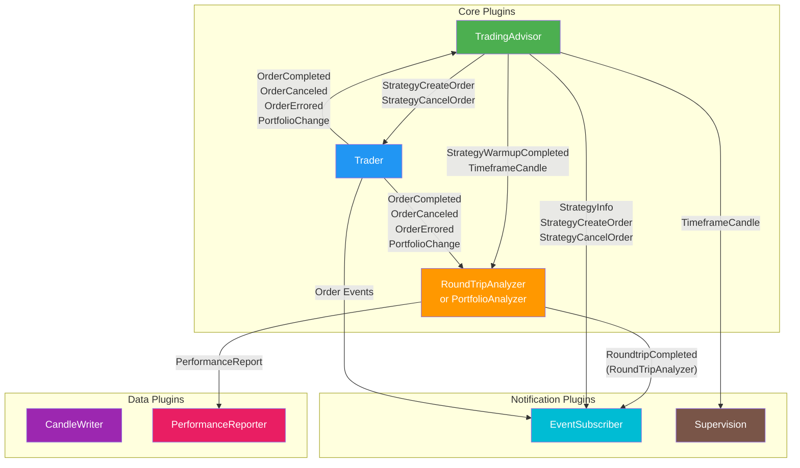

# 🔌 Plugins

Plugins are the modular components that extend Gekko 2's functionality. Each plugin handles a specific aspect of the trading workflow — from running strategies to executing orders, analyzing performance, and sending notifications. This guide provides detailed documentation for all available plugins.

---

## Overview

| Plugin                  | Purpose                                              | Mode Availability           |
|-------------------------|------------------------------------------------------|-----------------------------|
| **TradingAdvisor**      | Runs your strategy and generates trading signals     | Backtest, Realtime          |
| **Trader**              | Executes orders on exchanges                         | Backtest, Realtime          |
| **RoundTripAnalyzer**   | Measures performance round trip by round trip        | Backtest, Realtime          |
| **PortfolioAnalyzer**   | Measures performance from the portfolio's value      | Backtest, Realtime          |
| **PerformanceReporter** | Exports backtest results to CSV files                | Backtest                    |
| **CandleWriter**        | Saves candle data to the database                    | Importer, Realtime          |
| **EventSubscriber**     | Sends trading events to Telegram                     | Realtime                    |
| **Supervision**         | System monitoring and Telegram bot commands          | Realtime                    |

> [!IMPORTANT]
> Each entry under `plugins:` may only hold the options listed for its plugin below. An option the plugin does not know, misspelt (`maxConsecutiveError`) or meant for another plugin, stops Gekko at start-up with an `Unrecognized key` error naming it, instead of being ignored while the default applies. The top level of the file and its `watch`, `exchange` and `storage` sections refuse unknown keys the same way. The `strategy` block, whose `name` must equal the TradingAdvisor's `strategyName`, is checked by the strategy's own schema, which every built-in strategy declares: when the TradingAdvisor creates the strategy, at start-up, an unknown, missing or invalid parameter stops Gekko with an `Invalid parameters for strategy <name> (strategy block)` error listing every issue. A strategy that declares no schema, as a custom one may, gets the whole block unchecked (an `info` line says so), so a misspelt parameter is simply `undefined` there.

---

## 📈 TradingAdvisor

**Purpose:** The TradingAdvisor is the central plugin that runs your trading strategy and generates buy/sell signals. It acts as the bridge between market data and your strategy logic.

### How It Works

1. At start-up, creates your strategy, checks its `strategy` block, and reads from the exchange the balance and the orders open on each watched pair, which the strategy's `init` receives as `portfolio` and `openOrders`
2. Receives 1-minute candles from the market data stream (the strategy's `init` runs on the first one)
3. Batches candles into your configured timeframe (e.g., 1h, 4h, 1d)
4. Passes timeframe candles to your strategy
5. Relays strategy signals (create order, cancel order) to other plugins: the Trader executes the orders
6. Manages the strategy warmup period

The orders open at start-up are read once, and the run does not follow them: the Trader follows only the orders the strategy creates. There are none in a backtest or on `paper-binance`, whose simulator starts without any. GridBot refuses to start while any order is open on its pair, whatever placed it (a previous run's grid, an order placed by hand or by another bot): cancel them on the exchange, then start Gekko again.

### Configuration

```yaml
plugins:
  - name: TradingAdvisor
    strategyName: RSI          # Name of the strategy to run
    strategyPath: ./custom     # Optional: path to custom strategy file
    maxConsecutiveErrors: 5    # Optional: errored orders in a row that stop Gekko (at least 1, or -1: never)
```

### Configuration Reference

| Parameter              | Type     | Required | Default | Description                                                                                                   |
|------------------------|----------|----------|---------|---------------------------------------------------------------------------------------------------------------|
| `name`                 | string   | Yes      | —       | Must be `TradingAdvisor`                                                                                      |
| `strategyName`         | string   | Yes      | —       | Name of the strategy to use                                                                                   |
| `strategyPath`         | string   | No       | —       | Path to custom strategy (for external strategies)                                                             |
| `maxConsecutiveErrors` | integer  | No       | `5`     | Errored orders in a row after which Gekko stops (exit code 0), at least `1`; `-1` never stops, `0` is refused |

The strategy's `onOrderErrored` still runs for the error that trips the circuit breaker, before Gekko stops.

### Events

**Listens to:**
- `OrderCompleted` — Notifies strategy when orders are filled, and gives its candle hooks the portfolio after the fill
- `OrderCanceled` — Notifies strategy when orders are canceled, and gives its candle hooks the portfolio after the cancelation
- `OrderErrored` — Notifies strategy when orders fail, and gives its candle hooks the portfolio after the error
- `PortfolioChange` — Updates strategy with current portfolio state

The candle hooks get the latest portfolio received, from the candle after it arrived: the balance the TradingAdvisor reads at start-up, then the one a `portfolioChange` or the end of an order carries. The end of an order carries the portfolio the Trader read after it, even when its `portfolioUpdates` filter holds back the `portfolioChange`.

**Emits:**
- `StrategyCreateOrder` — Signal to create a new order, which the Trader executes
- `StrategyCancelOrder` — Signal to cancel an existing order
- `StrategyInfo` — The strategy's log lines (`tools.log`) at the `info`, `warn` and `error` levels, whatever `GEKKO_LOG_LEVEL`; its `debug` lines are only printed. An `error` line is delivered at once, not with the other events of its minute, so the line that stops the bot reaches the EventSubscriber's `strat_info`
- `StrategyWarmupCompleted` — Indicates warmup period has ended
- `TimeframeCandle` — Batched candle for the configured timeframe, queued after the strategy's hooks of that candle, and so after the warmup event that candle completes

### Dependencies

- Requires **exchange** injection: the market data of the watched pairs, and the balance and the open orders it hands to the strategy at start-up
- Credentials only on a real exchange (`binance` or `hyperliquid`, their sandbox included), whose balance and open orders need them; `dummy-cex` and `paper-binance` need none. A failed read stops Gekko at start-up
- Requires a **Trader** as soon as the strategy creates orders (see below)

> [!IMPORTANT]
> The TradingAdvisor is required for any mode that involves running a strategy (backtest or realtime trading).

> [!IMPORTANT]
> Configure a **Trader** with it, for alerts only too. The Trader is the only plugin that executes the orders the strategy creates, and ends each one with `orderCompleted`, `orderCanceled` or `orderErrored`. Every built-in strategy waits for its order to end before it advises again: without a Trader, its first order never ends and it advises once per run. On `paper-binance` (realtime) and `dummy-cex` (backtest) the Trader only simulates the orders, from `simulationBalance`; `hyperliquid` has no paper exchange, so its Trader places them on the account, or on its testnet with `sandbox: true`. Without a Trader, Gekko warns at start-up (`warn` level, so set `GEKKO_LOG_LEVEL` to `warn` or `info` to see it): `TradingAdvisor emits strategyCreateOrder, but no configured plugin executes orders…`. Only a strategy that never creates orders can do without one.

---

## 💹 Trader

**Purpose:** The Trader plugin executes orders on exchanges. It bridges the gap between strategy signals and actual order placement — whether on a live exchange, sandbox, or simulated dummy exchange.

### How It Works

1. Receives order signals from the TradingAdvisor
2. Validates orders against current portfolio and market conditions
3. Submits orders to the configured exchange
4. Monitors order status and handles fills/cancellations
5. Emits portfolio updates after order execution

### Configuration

```yaml
plugins:
  - name: Trader
    portfolioUpdates:          # Optional: emit the portfolio only when it changes significantly
      threshold: 1             # Change of an asset quantity, in %
      dust: 10                 # Value in quote currency below which an asset is ignored
```

### Configuration Reference

| Parameter                    | Type       | Required                   | Default | Description                                                                                                                              |
|------------------------------|------------|----------------------------|---------|------------------------------------------------------------------------------------------------------------------------------------------|
| `name`                       | string     | Yes                        | —       | Must be `Trader`                                                                                                                         |
| `portfolioUpdates`           | object     | No                         | —       | Without it, the portfolio is emitted after every synchronization; the end of an order carries the portfolio after it whatever the filter |
| `portfolioUpdates.threshold` | number ≥ 0 | Yes, in `portfolioUpdates` | —       | Change of an asset quantity, in % (`1` for 1%), that emits the portfolio                                                                 |
| `portfolioUpdates.dust`      | number ≥ 0 | Yes, in `portfolioUpdates` | —       | Value in quote currency below which an asset is ignored                                                                                  |

### Events

**Listens to:**
- `StrategyCreateOrder` — Receives new order requests from strategy
- `StrategyCancelOrder` — Receives cancel requests from strategy
- `StrategyWarmupCompleted` — Synchronizes with the exchange and emits the portfolio

**Emits:**
- `OrderInitiated` — Order has been submitted to exchange
- `OrderCompleted` — Order has been fully filled
- `OrderCanceled` — Order has been canceled
- `OrderErrored` — Order execution failed
- `PortfolioChange` — Portfolio balances have changed

A partial fill or a status change of an order is only logged (`info` level), not emitted. Each order ends in one of `OrderCompleted`, `OrderCanceled` and `OrderErrored`, which no other plugin emits: a built-in strategy waits for that end before it advises again (see the TradingAdvisor).

### Dependencies

- Requires **exchange** injection for order execution

### Order Types

The Trader supports multiple order types depending on your strategy:

| Order Type | Description                                                                               |
|------------|-------------------------------------------------------------------------------------------|
| `MARKET`   | Execute immediately at current market price                                               |
| `LIMIT`    | Execute at specified price or better                                                      |
| `STICKY`   | Limit order kept at the best bid (BUY) or ask (SELL), moved when the market moves past it |

A `STICKY` order is placed one minimum price step (`price.min` of the pair's market data) above the best bid for a BUY, below the best ask for a SELL, so that it leads the book. It is checked every `orderSynchInterval` of the exchange (20 s by default) in realtime, and at every minute in backtest: once the market has moved past it (a higher bid for a BUY, a lower ask for a SELL), it is canceled and what is left to fill is placed again at the new price. It has no option of its own. Like a `MARKET` order, it ignores the price an advice may give, which then only sizes a BUY without an amount.

### Exchange Modes

| Exchange        | Description                                                                  | Risk Level |
|-----------------|------------------------------------------------------------------------------|------------|
| `dummy-cex`     | Simulated exchange for backtesting                                           | None       |
| `paper-binance` | Simulated orders on live Binance data, from a `simulationBalance` (realtime) | None       |
| Sandbox         | Exchange testnet with virtual funds                                          | None       |
| Live            | Real exchange with real funds                                                | High       |

> [!CAUTION]
> When using the Trader with a live exchange, real money is at risk. Always test thoroughly with backtesting and sandbox trading first.

---

## 📊 RoundTripAnalyzer and PortfolioAnalyzer

**Purpose:** The analyzers measure how your strategy performs: its profit and return, the return of the market over the same period, its risk-adjusted ratios and its exposure. The **RoundTripAnalyzer** follows the trades of a single pair, as round trips from the BUY that opens a position to the SELL that closes it. The **PortfolioAnalyzer** follows the value of the whole portfolio, on one pair or several, at every timeframe candle. At the end of the run, the analyzer logs its performance report and sends it to the PerformanceReporter.

> [!IMPORTANT]
> Configure one analyzer, not both: they both emit `performanceReport`, and an event can only have one emitting plugin, so Gekko refuses to start with the two of them. Both run in backtest and realtime mode, on the data of the TradingAdvisor (warmup, timeframe candles) and of the Trader (orders, portfolio): without a portfolio from the Trader, the report is empty (all zeros) and a warning says so.

| Analyzer              | Measures                                                             | Pairs       | Specific to its report                                       |
|-----------------------|----------------------------------------------------------------------|-------------|--------------------------------------------------------------|
| **RoundTripAnalyzer** | Each round trip, from the BUY that opens it to the SELL that ends it | One         | Win rate, trade count, largest adverse excursions            |
| **PortfolioAnalyzer** | The equity curve: the portfolio's value at every timeframe candle    | One or more | Max and longest drawdown, benchmark asset, portfolio changes |

### Configuration

```yaml
plugins:
  - name: RoundTripAnalyzer    # Or PortfolioAnalyzer: both take the same options
    riskFreeReturn: 5          # Yearly risk-free return (%)
    enableConsoleTable: true   # Print the report as a table in the terminal
```

### Configuration Reference

| Parameter            | Type       | Required | Default | Description                                                                                                      |
|----------------------|------------|----------|---------|------------------------------------------------------------------------------------------------------------------|
| `name`               | string     | Yes      | —       | `RoundTripAnalyzer` or `PortfolioAnalyzer`                                                                       |
| `riskFreeReturn`     | number ≥ 0 | No       | `5`     | Yearly return of a riskless investment (%), which the Sharpe and Sortino ratios subtract                         |
| `enableConsoleTable` | boolean    | No       | `false` | Print the report as a table instead of a log line (the RoundTripAnalyzer also prints each round trip as a table) |

### How Both Work

1. The period measured starts when the strategy's warmup completes, at the close of the timeframe candle that completes it (the end of its last minute), when the strategy starts to act. It ends with the last minute of the run.
2. The start equity is the latest portfolio received from the Trader, valued at the closes of that minute, the prices the market return starts from too. If no portfolio has arrived by then, the first one received afterwards gives it, valued at the prices of that moment, with a warning when those are no longer the start prices.
3. The portfolio valued is the latest one received, with a `portfolioChange`, an `orderCompleted`, an `orderCanceled` or an `orderErrored` (each order event carries the portfolio the Trader read after it, except the empty one it sends before any of its synchronizations succeeds, which is ignored): the Trader's `portfolioUpdates` filter can hold back the `portfolioChange` of a small fill. It is marked to market at the close of every timeframe candle, and once more at the end of the run.
4. At the end of the run, the report is computed, logged at the `info` level (start Gekko with `GEKKO_LOG_LEVEL=info` to see it) or printed as a table with `enableConsoleTable`, and emitted as `performanceReport` for the PerformanceReporter. It is sent from `processFinalize`, so it is emitted directly: a handler gets the report itself, not an array of payloads.

### RoundTripAnalyzer

It watches a single pair: with more than one asset in `watch.assets`, Gekko stops at start-up. It values the pair alone (the asset at the pair's price, plus the currency) and follows the orders the Trader fills:

- A BUY completed while flat opens a round trip. Its entry equity is the pair equity just before that BUY: the equity right after it, plus its fee. More BUYs add to the position, and the entry price is the mean of the BUY prices weighted by their amounts.
- SELLs reduce the position, and the exit price is the mean of their prices weighted by their amounts. The round trip ends once what is left of the position (bought, not sold yet and still held) is at most 1 % of the amount bought (`DUST_TOLERANCE`): the dust left by an amount rounded to the exchange's lot size, or by a fee taken in the asset, does not keep it open.
- A BUY or a SELL canceled after a partial fill counts for the part that filled, as a trade dated at the cancelation and priced at the order's price (the last close for an order without a price, such as a MARKET order), its fee unknown and counted as 0.
- A SELL while flat ends no round trip. Before the first trade of the period, such as one that sells an asset held before it, it is not counted as a trade either.
- Its `pnl` is the pair equity after the SELL that ends it minus its entry equity, and its `profit` the same in % of the entry equity: both are net of the fees of all its orders. Its maximum adverse excursion (MAE) is the deepest fall of a 1-minute low below its entry price (the weighted mean of its BUYs so far), from the end of the warmup until it ends, in % of the entry price.
- Each round trip is logged at the `info` level (and printed as a table with `enableConsoleTable`) and emitted as `roundtripCompleted`, which the EventSubscriber can relay to Telegram.
- The report covers the period only, and no trade comes before it: until the warmup is over, the strategy cannot create an order (`tools.createOrder` stops Gekko with an error, even from `init`).
- The exposure is the time spent in round trips during the period, the one still open at the end included.
- A position still open at the end is logged with its unrealized P&L at the last close. The final balance and the exposure include it; the win rate, the ratios and the MAEs, which only count the closed round trips, leave it out.

**Listens to:**
- `StrategyWarmupCompleted` — Starts the period and takes the start equity
- `TimeframeCandle` — Marks the pair equity to market
- `PortfolioChange` — Updates the portfolio it values
- `OrderCompleted` — Opens, extends and ends the round trips, and refreshes the portfolio it values
- `OrderCanceled` — Counts the part of a canceled order that filled, and refreshes the portfolio it values
- `OrderErrored` — Refreshes the portfolio it values

**Emits:**
- `RoundtripCompleted` — A round trip has ended
- `PerformanceReport` — The report, at the end of the run

### PortfolioAnalyzer

It values the whole portfolio, on one pair or several: the currency plus every watched asset at its latest close (an asset that is not watched, such as BNB kept for the fees, is left out).

- The equity curve gets a point at the close of every timeframe candle after the warmup, the one that completes it included: the latest portfolio valued at that candle's closes. Each of these points is emitted as `equitySnapshot`, once per timeframe candle (no built-in plugin listens to it; a custom one can, with `onEquitySnapshot`). At the end of the run, the latest portfolio at the last prices ends the curve: it replaces the value of the last point when the run ends at the close of a timeframe candle, and is added otherwise; it is not emitted.
- It listens to `orderCompleted`, `orderCanceled` and `orderErrored` only to refresh the portfolio it values (see step 3 above: the Trader's `portfolioUpdates` filter can hold back the `portfolioChange` of a small fill): none of them adds a point to the curve, nor counts as a portfolio change.
- The returns of the curve, one per timeframe candle, give the volatility and the ratios. The curve also gives the max drawdown (the largest fall from a peak, the start equity being the first peak) and the longest drawdown (the longest time from a peak to the point that gets back to it, or to the end of the run).
- The exposure is the share of the period during which the portfolio held an asset other than the currency worth at least 1 % of the portfolio, at the latest prices, counted one timeframe at a time. Neither the dust left by a SELL nor a position deliberately kept under 1 % of the equity counts.
- The market return is that of the benchmark asset: BTC when it is watched, otherwise the first asset of `watch.assets`. The start and end prices of the report are its prices.

**Listens to:**
- `StrategyWarmupCompleted` — Starts the period and takes the start equity
- `TimeframeCandle` — Adds a point to the equity curve
- `PortfolioChange` — Updates the portfolio it values
- `OrderCompleted` — Refreshes the portfolio it values, without adding a point to the curve
- `OrderCanceled` — Refreshes the portfolio it values, without adding a point to the curve
- `OrderErrored` — Refreshes the portfolio it values, without adding a point to the curve

**Emits:**
- `EquitySnapshot` — A point of the equity curve, once per timeframe candle after the warmup
- `PerformanceReport` — The report, at the end of the run

### Performance Report

The report holds the fields of `Report` (`src/models/event.types.ts`), and those of its analyzer. The PerformanceReporter writes it as a row of CSV (see its columns below).

| Field                                        | Analyzer  | Description                                                                                                                                                |
|----------------------------------------------|-----------|------------------------------------------------------------------------------------------------------------------------------------------------------------|
| `id`                                         | Both      | `TRADING REPORT` (RoundTripAnalyzer) or `PORTFOLIO PROFIT REPORT` (PortfolioAnalyzer)                                                                      |
| `periodStartAt`, `periodEndAt`               | Both      | Start and end of the period (epoch milliseconds)                                                                                                           |
| `formattedDuration`                          | Both      | Length of the period, such as `3 months 2 days`                                                                                                            |
| `netProfit`                                  | Both      | End equity minus start equity, in quote currency                                                                                                           |
| `totalReturnPct`                             | Both      | Return over the period (%)                                                                                                                                 |
| `annualizedNetProfit`, `annualizedReturnPct` | Both      | Net profit and return per year (see below)                                                                                                                 |
| `marketReturnPct`                            | Both      | Return of holding the asset, or the benchmark asset, over the period (%)                                                                                   |
| `alpha`                                      | Both      | Total return minus market return, in percentage points                                                                                                     |
| `exposurePct`                                | Both      | Share of the period spent exposed (%)                                                                                                                      |
| `volatility`                                 | Both      | Standard deviation of the returns (%)                                                                                                                      |
| `downsideDeviation`                          | Both      | Root mean square of the negative returns, the positive ones counting as 0 (%)                                                                              |
| `sharpeRatio`, `sortinoRatio`                | Both      | Risk-adjusted returns, annualized (see below)                                                                                                              |
| `startPrice`, `endPrice`                     | Both      | Price of the asset, or of the benchmark asset, at the start and at the end                                                                                 |
| `interruption`                               | Both      | Message of the error that stopped the run before its end (a crash, missing candles, the circuit breaker), absent when it completed                         |
| `startBalance`, `finalBalance`               | RoundTrip | Pair equity at the start and at the end, a position still open included                                                                                    |
| `winRate`                                    | RoundTrip | Share of the closed round trips with a positive P&L (%), `null` without any                                                                                |
| `tradeCount`                                 | RoundTrip | Trades of the period: orders completed and canceled ones that filled in part, from the first BUY on                                                        |
| `topMAEs`                                    | RoundTrip | The 10 largest maximum adverse excursions (%), largest first                                                                                               |
| `startEquity`, `endEquity`                   | Portfolio | Portfolio value at the start and at the end                                                                                                                |
| `equityCurve`                                | Portfolio | The points of the equity curve, `{ date, totalValue }`                                                                                                     |
| `maxDrawdownPct`                             | Portfolio | Largest fall from a peak of the equity curve (%)                                                                                                           |
| `longestDrawdownMs`                          | Portfolio | Longest drawdown (milliseconds)                                                                                                                            |
| `portfolioChangeCount`                       | Portfolio | Portfolio changes received                                                                                                                                 |
| `benchmarkAsset`                             | Portfolio | Asset whose price gives the market return                                                                                                                  |

A `roundtripCompleted` payload (`RoundTrip`) holds the round trip's `id` (0 for the first one of the run), `entryAt`, `entryPrice`, `entryEquity`, `exitAt`, `exitPrice`, `exitEquity`, `duration` (milliseconds), `pnl`, `profit` (%) and `maxAdverseExcursion` (%). An `equitySnapshot` payload is a `{ date, totalValue }` point of the equity curve.

### How the Statistics Are Computed

Both analyzers compute them the same way, each from its own returns: the profit of each closed round trip for the RoundTripAnalyzer, the change of the equity curve at each timeframe candle for the PortfolioAnalyzer. The annualized figures (net profit, return, Sharpe and Sortino ratios) share one horizon: the period, or a day for a run shorter than a day, as if its returns had been spread over that day, and a warning says so then: annualized over its own length, a run of a few minutes would turn the moves of a few candles into a yearly return of thousands of %.

- **Annualized net profit and return** (`yearly profit` in the CSV): the net profit and the total return divided by the horizon in years. The annualization is linear, without compounding: +5 % over half a year is +10 % a year.
- **Sharpe ratio:** the annualized return minus `riskFreeReturn`, divided by the standard deviation of the returns annualized by √(returns per year), the returns per year being their number divided by the horizon in years. It is 0 without a return or without volatility.
- **Sortino ratio:** the same, with the downside deviation in place of the standard deviation: the root mean square of the negative returns, the positive ones counting as 0. It is 0 when no return is negative.
- **Alpha:** the total return minus the market return.

### Understanding the Metrics

> [!TIP]
> **Sharpe Ratio Interpretation:**
> - Below 1.0: Suboptimal risk-adjusted returns
> - 1.0 - 2.0: Good risk-adjusted performance
> - 2.0 - 3.0: Very good performance
> - Above 3.0: Excellent (rare in real trading)

> [!NOTE]
> The `riskFreeReturn` parameter is used in Sharpe and Sortino ratio calculations. Adjust this based on current treasury rates or your opportunity cost of capital; `0` (cash that earns nothing) is accepted.

---

## 📋 PerformanceReporter

**Purpose:** The PerformanceReporter exports backtest results to CSV files, enabling easy comparison across multiple backtest runs and external analysis.

### How It Works

1. Receives the performance report of the PortfolioAnalyzer or of the RoundTripAnalyzer
2. Identifies the run by the values of the `strategy` block joined by `-` (the `id` column), the same for every run with the same parameters
3. Appends the row to the CSV file while holding a lock file, `<fileName>.lock`, next to it, so that backtests ending together do not write into each other's rows. It makes up to 6 attempts, 25 to 75 ms apart. If the lock is still held, the report is lost and an error says so, naming the lock file. A lock left behind by a run killed while writing (kill -9, Ctrl-C at that instant, a crash) is taken over automatically once it is 30 s old. Before that, delete it by hand if no other run is writing the file. A `<fileName>.lock.takeover` file left by a run killed while taking such a lock over is handled the same way.
4. Creates the output directory and file if they don't exist

### Configuration

```yaml
plugins:
  - name: PerformanceReporter
    filePath: ./reports        # Directory for CSV output
    fileName: backtest.csv     # Output filename
```

### Configuration Reference

| Parameter  | Type   | Required | Default                   | Description                            |
|------------|--------|----------|---------------------------|----------------------------------------|
| `name`     | string | Yes      | —                         | Must be `PerformanceReporter`          |
| `filePath` | string | No       | Current working directory | Directory for output file              |
| `fileName` | string | No       | `performance_reports.csv` | Name of the output CSV file, not empty |

### Events

**Listens to:**
- `PerformanceReport` — Receives final performance statistics

### CSV Output Format

The reports of the PortfolioAnalyzer and of the RoundTripAnalyzer share one header, so both can be appended to the same file. A column that a report type does not have is left empty (*Portfolio only* / *Trading only* below). The lock of step 3 above covers writing the header of a new or empty file, checking the header and appending the row, so that no other run writes in between. The reporter never appends to a file whose first line is not this header, such as a file written by an older version: it logs an error and skips the report, so move or rename that file. A byte order mark at the start of the file and a `\r\n` line ending after the header, which Excel and LibreOffice add when they save the file back on Windows, are accepted; the rows the reporter appends still end with `\n`. The layout changed when the `timeframe` column was added and `pair` went back to holding the watched pairs (it had been repeating the report type), and again when the `status` column was added, so every file written before that is refused: the 28-column files without `status`, and the files of the version that wrote one header per report type, ending in `;status`.

Cells are separated by `;`. A cell that holds a `;`, a double quote or a line break (a strategy parameter, for example) is enclosed in double quotes, and its own double quotes are doubled: the usual CSV quoting, which spreadsheets read back as the original value.

Amounts and prices (`net profit`, the profit in `yearly profit`, `start balance`, `final balance`, `start price`, `end price`) are plain numbers, written the same whatever the locale of the machine: a `.` decimal separator, no thousands separator and up to 8 decimals, so that a price of a fraction of a cent or a profit in BTC keeps its value (e.g., `1234.5678`, `0.0000012`). A value that is not a number leaves its cell empty. Percentages are rounded to 2 decimals: down for `total return`, the return in `yearly profit`, `market`, `alpha` and `max drawdown` (so `-1.234` is written `-1.24%`), to the nearest for `win rate` and `exposure`. The ratios and deviations (`sharpe ratio`, `sortino ratio`, `standard deviation`, `downside deviation`) are written with 2 decimals, such as `1.50` (`0.00` for any value between -0.005 and 0.005). `top maes` is a JSON array of the unrounded values, largest first (e.g., `[4.218765432098766,1.5]`). Rows written by earlier versions can hold amounts rounded to 3 decimals and grouped in the machine's locale (`1,234.568`, or `1 234,568` on a French machine).

| Column                      | Description                                                                                                                                                  |
|-----------------------------|--------------------------------------------------------------------------------------------------------------------------------------------------------------|
| `id`                        | `strategy` block values joined by `-` (e.g., `RSI-21-70-30-0`)                                                                                               |
| `report type`               | `Portfolio` (PortfolioAnalyzer) or `Trading` (RoundTripAnalyzer)                                                                                             |
| `pair`                      | Watched pairs, separated by a space (e.g., `BTC/USDT ETH/USDT`)                                                                                              |
| `timeframe`                 | Candle timeframe of the run, `watch.timeframe` (e.g., `1h`)                                                                                                  |
| `net profit`                | Profit in quote currency                                                                                                                                     |
| `total return`              | Return over the period (%)                                                                                                                                   |
| `yearly profit`             | Annualized net profit, with the annualized return (%): over the period, or a day for a shorter run                                                           |
| `win rate`                  | Share of profitable round trips (%), `N/A` without any, *Trading only*                                                                                       |
| `market`                    | Buy-and-hold return (%)                                                                                                                                      |
| `alpha`                     | Excess return vs market (%)                                                                                                                                  |
| `sharpe ratio`              | Sharpe ratio, annualized over the same horizon as `yearly profit`                                                                                            |
| `sortino ratio`             | Sortino ratio, annualized over the same horizon as `yearly profit`                                                                                           |
| `max drawdown`              | Maximum drawdown (%), *Portfolio only*                                                                                                                       |
| `total changes`             | Number of portfolio changes, *Portfolio only*                                                                                                                |
| `trade count`               | Number of trades of the period (orders completed, canceled ones that filled in part), from the first BUY on, *Trading only*                                  |
| `start time`                | Start of the period, when the warmup completed (ISO 8601)                                                                                                    |
| `end time`                  | End of the period, the end of the last minute (ISO 8601)                                                                                                     |
| `duration`                  | Length of the period (e.g., `3 months 2 days`)                                                                                                               |
| `exposure`                  | Share of the period in a position (%): in round trips, the open one included (*Trading*); holding an asset worth at least 1 % of the portfolio (*Portfolio*) |
| `start balance`             | Value at start in quote currency: the portfolio (*Portfolio*), the pair equity, asset at the pair's price plus currency (*Trading*)                          |
| `final balance`             | Value at end in quote currency: the portfolio (*Portfolio*), the pair equity, asset at the pair's price plus currency (*Trading*)                            |
| `start price`               | Asset price at start (of the benchmark asset, *Portfolio*)                                                                                                   |
| `end price`                 | Asset price at end (of the benchmark asset, *Portfolio*)                                                                                                     |
| `standard deviation`        | Standard deviation of the returns: of the round trips (*Trading*), of the timeframe candles (*Portfolio*)                                                    |
| `downside deviation`        | Root mean square of the negative returns, the positive ones counting as 0                                                                                    |
| `longest drawdown duration` | Duration of the longest drawdown, *Portfolio only*                                                                                                           |
| `benchmark asset`           | Asset whose price gives the market return, *Portfolio only*                                                                                                  |
| `top maes`                  | The 10 largest maximum adverse excursions (%), as a JSON array, *Trading only*                                                                               |
| `status`                    | `completed`, or `interrupted: <reason>` when the run stopped before its end (the message of the error that stopped it, quoted when it holds a `;`)           |

> [!TIP]
> Use the PerformanceReporter when running multiple backtests with different parameters. The CSV format makes it easy to analyze results in spreadsheet software or import into data analysis tools.

---

## 💾 CandleWriter

**Purpose:** The CandleWriter saves candle data to the configured database. It's essential for the Importer mode and optional for Realtime mode if you want to persist incoming market data.

### How It Works

1. Receives 1-minute candles from the pipeline
2. Buffers candles in memory for efficiency
3. Writes candles to the database in batches
4. Flushes remaining candles on finalization

### Configuration

```yaml
plugins:
  - name: CandleWriter
```

### Configuration Reference

| Parameter | Type   | Required | Default | Description             |
|-----------|--------|----------|---------|-------------------------|
| `name`    | string | Yes      | —       | Must be `CandleWriter`  |

### Dependencies

- Requires **storage** injection for database access

### Mode Usage

| Mode      | Required | Purpose                                        |
|-----------|----------|------------------------------------------------|
| Importer  | Yes      | Store fetched historical candles               |
| Realtime  | No       | Optionally persist live candles for later use  |

> [!IMPORTANT]
> The CandleWriter is **required** for Importer mode. Without it, fetched historical data will not be saved to the database.

---

## 📱 EventSubscriber

**Purpose:** The EventSubscriber sends trading events to Telegram, keeping you informed about strategy signals, order executions, and trading activity in real-time.

### How It Works

1. Connects to Telegram Bot API using your bot token
2. Listens for commands to manage event subscriptions
3. Filters events based on your active subscriptions
4. Sends formatted messages for relevant trading events

> [!NOTE]
> Messages go out in the background, one at a time and in the order of their events, so a slow or unreachable Telegram never holds up candles or orders. Up to 1000 wait their turn, enough for a burst such as a grid strategy placing hundreds of orders at once; beyond that, each new one drops the oldest, with a single warning until the queue has emptied (the next drops are logged at the `debug` level). When sends keep failing (the bot blocked, a wrong `chatId`), only the first failure is a warning: the next ones are logged at the `debug` level until a message goes out again, which is logged at the `info` level. When Gekko stops on its own (circuit breaker or error) it waits at most 15 s for them, those queued while it stops included; Ctrl-C or a kill signal does not wait.

### Configuration

```yaml
plugins:
  - name: EventSubscriber
    token: YOUR_TELEGRAM_BOT_TOKEN
    botUsername: YOUR_BOT_USERNAME
    chatId: 123456789 # Your chat id, a number: the only chat the bot answers and notifies
```

### Configuration Reference

| Parameter     | Type    | Required          | Default | Description                                                                                                                                 |
|---------------|---------|-------------------|---------|---------------------------------------------------------------------------------------------------------------------------------------------|
| `name`        | string  | Yes               | —       | Must be `EventSubscriber`                                                                                                                   |
| `token`       | string  | Yes               | —       | Telegram Bot API token                                                                                                                      |
| `botUsername` | string  | Yes               | —       | Your Telegram bot's username                                                                                                                |
| `chatId`      | integer | No, but advisable | —       | The only chat whose commands the bot handles and that gets its messages (positive for a private chat, negative for a group; `0` is refused) |

> [!IMPORTANT]
> Anyone can find a Telegram bot by its username and write to it. With `chatId` set, the bot only takes commands from that chat and only sends its notifications there, from start-up; whatever another chat sends is ignored. Every member of that chat can command the bot, so prefer your private chat to a group.
>
> Without `chatId`, the bot belongs to the first chat that sends it a command once Gekko has started (a plain text does not count, and whatever was sent to the bot while Gekko was not running is dropped at start-up: send it again) until Gekko stops. It warns about it at start-up (`warn` level) and logs the chat it takes at the `info` level, with its id and whose chat it is (`private chat with @you`, `group "Title"`). To find your chat id, start Gekko with `GEKKO_LOG_LEVEL=info`, then press **Start** in your chat with the bot (or send it `/help`), check that the log line that says `set chatId: <id>` names your own chat, and copy the id from it; or ask [@userinfobot](https://t.me/userinfobot), which replies with your id. If the bot does not answer you, `GEKKO_LOG_LEVEL=debug` shows why it ignored a message: a chat other than its own (with that chat's id), a command addressed to another bot, which names both bots (a misspelt `botUsername` ignores every command tapped in a group's menu), or, while it has no chat yet, a text that is not a command (once bound, it ignores a plain text from its own chat without a log line).

### Events

**Listens to:**
- `StrategyInfo` — The strategy's log lines at the `info`, `warn` and `error` levels
- `StrategyCreateOrder` — New order signals from strategy
- `StrategyCancelOrder` — Order cancellation signals from strategy
- `OrderInitiated` — Orders submitted to exchange
- `OrderCanceled` — Canceled orders
- `OrderErrored` — Failed orders
- `OrderCompleted` — Filled orders
- `RoundtripCompleted` — Closed round trips (sent by the RoundTripAnalyzer)

### Telegram Commands

Control your subscriptions via Telegram commands:

| Command                   | Description                                |
|---------------------------|--------------------------------------------|
| `/help`                   | Show all available commands                |
| `/start`                  | Same as `/help` (sent by the Start button) |
| `/subscribe_all`          | Subscribe to all event types               |
| `/unsubscribe_all`        | Unsubscribe from all events                |
| `/subscriptions`          | List current active subscriptions          |
| `/sub_<event>`            | Toggle subscription for specific event     |

> [!NOTE]
> A command can also be addressed to the bot, as `/help@your_bot`, to single it out in a group with other bots. A command addressed to another bot is ignored.

### Available Event Types

| Event Type           | Description                                                                                                                                  |
|----------------------|----------------------------------------------------------------------------------------------------------------------------------------------|
| `strat_info`         | The strategy's log lines at `info`, `warn` and `error` (not `debug`), whatever `GEKKO_LOG_LEVEL`, the error line that stops the bot included |
| `strat_create`       | New order signals from strategy                                                                                                              |
| `strat_cancel`       | Order cancellation signals from strategy                                                                                                     |
| `order_init`         | Order submitted to exchange                                                                                                                  |
| `order_cancel`       | Order cancellation confirmed, with what it filled first: `Filled amount: not reported` when the exchange reported no fill                    |
| `order_error`        | Order execution failed, with a line saying so when the order may still be live on the exchange, to be checked there                          |
| `order_complete`     | Order fully executed                                                                                                                         |
| `roundtrip_complete` | Round trip closed, with its PnL (needs the `RoundTripAnalyzer`)                                                                              |

### Example Notifications

**Order Completed:**
```
BUY MARKET order completed (abc-123-def) for BTC/USDT
Amount: 0.5 BTC
Price: 42542.5 USDT
Fee percent: 0.1%
Fee: 21.25 USDT
At time: 2024-01-15T14:30:00.000Z
Current portfolio: 0.5 BTC / 47500 USDT
------
```

`Price` includes the fee. When no trade of the order reported a fee rate, it reads `Price (excluding fee): 42500 USDT`, with `Fee percent: unknown` and `Fee: unknown`.

> [!TIP]
> Create a Telegram bot by messaging [@BotFather](https://t.me/BotFather) and following the instructions. Keep your token secure!

---

## 🔧 Supervision

**Purpose:** The Supervision plugin provides system monitoring and health checks via Telegram. It alerts you when resource usage exceeds thresholds and allows you to control monitoring remotely.

### How It Works

1. Connects to Telegram Bot API for command/response interaction
2. Monitors CPU and memory usage at configurable intervals
3. Sends alerts when thresholds are exceeded
4. Validates candle data against exchange for accuracy
5. Monitors application logs and forwards warnings/errors

### Configuration

```yaml
plugins:
  - name: Supervision
    token: YOUR_TELEGRAM_BOT_TOKEN
    botUsername: YOUR_BOT_USERNAME
    chatId: 123456789             # Your chat id, a number: the only chat the bot answers and alerts
    cpuThreshold: 80              # Alert if CPU > 80%
    memoryThreshold: 1024         # Alert if memory > 1024 MB
    cpuCheckInterval: 10000       # Check CPU every 10 seconds
    memoryCheckInterval: 10000    # Check memory every 10 seconds
    logMonitoringInterval: 60000  # Check logs every 60 seconds
    candleCheckInterval: 60000    # Check every 60 seconds that 1m candles keep coming
    candleStaleThreshold: 180000  # Alert when no 1m candle came for 3 minutes
```

### Configuration Reference

| Parameter               | Type    | Required          | Default | Description                                                                                                                                 |
|-------------------------|---------|-------------------|---------|---------------------------------------------------------------------------------------------------------------------------------------------|
| `name`                  | string  | Yes               | —       | Must be `Supervision`                                                                                                                       |
| `token`                 | string  | Yes               | —       | Telegram Bot API token                                                                                                                      |
| `botUsername`           | string  | Yes               | —       | Your Telegram bot's username                                                                                                                |
| `chatId`                | integer | No, but advisable | —       | The only chat whose commands the bot handles and that gets its messages (positive for a private chat, negative for a group; `0` is refused) |
| `cpuThreshold`          | number  | No                | `80`    | CPU usage alert threshold (%)                                                                                                               |
| `memoryThreshold`       | number  | No                | `1024`  | Memory usage alert threshold (MB)                                                                                                           |
| `cpuCheckInterval`      | integer | No                | `10000` | CPU check interval (milliseconds)                                                                                                           |
| `memoryCheckInterval`   | integer | No                | `10000` | Memory check interval (milliseconds)                                                                                                        |
| `logMonitoringInterval` | integer | No                | `60000` | Log monitoring interval (milliseconds)                                                                                                      |
| `candleCheckInterval`   | integer | No                | `60000` | Candle freshness check interval (milliseconds)                                                                                              |
| `candleStaleThreshold`  | integer | No                | `180000` | Age of the last 1-minute candle beyond which the candle check alerts that the candles stopped coming (milliseconds, above `60000`)          |

The four intervals (`cpuCheckInterval`, `memoryCheckInterval`, `logMonitoringInterval` and `candleCheckInterval`) are whole milliseconds between `1000` (one second) and `2147483647` (about 24.8 days, the longest timer delay). `candleStaleThreshold` is a whole number of milliseconds above `60000`: the 1-minute candles come once a minute, so a shorter threshold would alert between every two of them.

> [!IMPORTANT]
> Set `chatId`, as for the EventSubscriber above (whose configuration section also tells how to find your chat id): without it, the first chat to send the bot a command after start-up gets the alerts and the forwarded logs, and controls the monitoring, until Gekko stops.

### Events

**Listens to:**
- `TimeframeCandle` — Validates candles against exchange data

### Telegram Commands

Control monitoring via Telegram commands:

| Command                      | Description                                |
|------------------------------|--------------------------------------------|
| `/help`                      | Show all available commands                |
| `/start`                     | Same as `/help` (sent by the Start button) |
| `/healthcheck`               | Check if Gekko is running                  |
| `/sub_cpu_check`             | Toggle CPU usage monitoring                |
| `/sub_memory_check`          | Toggle memory usage monitoring             |
| `/sub_candle_check`          | Toggle the candle checks (see below)       |
| `/sub_monitor_log`           | Toggle log monitoring (warns/errors)       |
| `/subscribe_all`             | Subscribe to all monitoring                |
| `/unsubscribe_all`           | Unsubscribe from all monitoring            |
| `/subscriptions`             | List current active subscriptions          |

> [!NOTE]
> A command can also be addressed to the bot, as `/help@your_bot`, to single it out in a group with other bots. A command addressed to another bot is ignored.

> [!NOTE]
> Once Gekko is stopping, a command that would start a monitoring (`/subscribe_all`, or a `/sub_...` that subscribes) is answered `Gekko is stopping: no monitoring can start any more` and starts nothing. Unsubscribing still works.

### Monitoring Features

| Feature               | Description                                              |
|-----------------------|----------------------------------------------------------|
| **Health Check**      | Verify the bot process is running                        |
| **CPU Monitoring**    | Alert when CPU usage exceeds threshold                   |
| **Memory Monitoring** | Alert when memory usage exceeds threshold                |
| **Candle Validation** | Compare local candles with exchange data for accuracy    |
| **Candle Freshness**  | Alert when the 1-minute candles stop coming              |
| **Log Monitoring**    | Forward warning and error logs to Telegram               |

### Example Alerts

**CPU Alert:**
```
⚠️ CPU usage exceeded: 85.42%
```

**Memory Alert:**
```
⚠️ Memory usage exceeded: 1156.78 MB
```

**Candle Mismatch** (one line per field that differs, the exchange's value first):
```
⚠️ Timeframe candle mismatch detected: BTC/USDT 1h candle starting at 2024-01-15T14:00:00.000Z (exchange | Gekko)
close: 42500 | 42498
volume: 1234.5 | 1234.7
```

**Candle Stall** (then one message when the candles come again):
```
⚠️ No 1m candle received for 3 minute(s), last one @ 2024-01-15T14:00:00.000Z
✅ 1m candles are coming again, last one @ 2024-01-15T14:05:00.000Z
```

> [!NOTE]
> `/sub_candle_check` turns on both candle checks. The validation compares each timeframe candle with the exchange's. The freshness check looks every `candleCheckInterval` at the age of the last 1-minute bucket, because the strategy, the trailing stops and the circuit breaker only run on candles: it sends one alert when that age exceeds `candleStaleThreshold`, then one message when the candles come again. An alert Telegram did not take is logged as a warning and sent again at the next check. Before the first bucket, the age is counted from the subscription, so a subscription made before a warmup longer than the threshold alerts before any candle came.

> [!NOTE]
> The candle check runs in the background, so a slow or unreachable exchange or Telegram never holds up candles or orders. A timeframe candle that closes while the check of the previous one is still running is not checked (a debug log line says so).

> [!NOTE]
> The Supervision plugin is designed for production deployments where monitoring bot health is critical. For development and testing, it's typically not needed.

### Dependencies

- Requires **exchange** injection for candle validation feature

---

## Plugin Dependencies

Understanding plugin dependencies helps you configure the correct combination for your use case.

### Dependency Graph


```mermaid
graph TD
    subgraph Core Plugins
        TA[TradingAdvisor]
        TR[Trader]
        AN["RoundTripAnalyzer<br>or PortfolioAnalyzer"]
    end
    
    subgraph Data Plugins
        CW[CandleWriter]
        PR[PerformanceReporter]
    end
    
    subgraph Notification Plugins
        ES[EventSubscriber]
        SU[Supervision]
    end
    
    TA -->|"StrategyCreateOrder<br>StrategyCancelOrder"| TR
    TA -->|"TimeframeCandle"| SU
    TR -->|"OrderCompleted<br>OrderCanceled<br>OrderErrored<br>PortfolioChange"| TA
    TA -->|"StrategyWarmupCompleted<br>TimeframeCandle"| AN
    TR -->|"OrderCompleted<br>OrderCanceled<br>OrderErrored<br>PortfolioChange"| AN
    AN -->|"PerformanceReport"| PR
    AN -->|"RoundtripCompleted<br>(RoundTripAnalyzer)"| ES
    TA -->|"StrategyInfo<br>StrategyCreateOrder<br>StrategyCancelOrder"| ES
    TR -->|"Order Events"| ES
    
    style TA fill:#4CAF50,color:white
    style TR fill:#2196F3,color:white
    style AN fill:#FF9800,color:white
    style CW fill:#9C27B0,color:white
    style PR fill:#E91E63,color:white
    style ES fill:#00BCD4,color:white
    style SU fill:#795548,color:white
```

---

## Recommended Plugin Combinations

### Importer Mode

```yaml
plugins:
  - name: CandleWriter    # Required to save candles
```

### Backtest Mode

```yaml
plugins:
  - name: TradingAdvisor
    strategyName: YourStrategy

  - name: Trader

  - name: RoundTripAnalyzer      # Or PortfolioAnalyzer, not both
    enableConsoleTable: true

  - name: PerformanceReporter    # Optional: export to CSV
    filePath: ./reports
```

### Realtime Screener (Alerts Only)

```yaml
exchange:
  name: paper-binance           # Real Binance prices, simulated orders: no API key
  simulationBalance:            # Simulated balances, required by paper-binance
    - assetName: BTC
      balance: 1
    - assetName: USDT
      balance: 10000

plugins:
  - name: TradingAdvisor
    strategyName: RSI

  - name: Trader                # Simulates the orders, whose end the strategy waits for

  - name: EventSubscriber
    token: YOUR_TOKEN
    botUsername: YOUR_BOT
    chatId: 123456789           # Your chat id
```

Keep the Trader, even for alerts: without it, the first order of the strategy never ends, and a built-in strategy advises once per run (see the TradingAdvisor above). On `paper-binance` it trades nothing for real: the orders are simulated from `simulationBalance`.

### Realtime Trading

```yaml
plugins:
  - name: TradingAdvisor
    strategyName: DEMA

  - name: Trader

  - name: PortfolioAnalyzer
    riskFreeReturn: 5

  - name: EventSubscriber       # Notifications, through a first bot
    token: YOUR_EVENTS_BOT_TOKEN
    botUsername: YOUR_EVENTS_BOT
    chatId: 123456789           # Your chat id

  - name: Supervision           # Health monitoring, through a second bot
    token: YOUR_SUPERVISION_BOT_TOKEN
    botUsername: YOUR_SUPERVISION_BOT
    chatId: 123456789           # The same chat can get both bots
```

> [!NOTE]
> Each Telegram plugin needs its own bot, with its own token: Telegram serves a bot's updates (`getUpdates`) to a single reader at a time, so two plugins on one token conflict, with HTTP 409 errors, and lose each other's commands. Both bots can talk to the same chat.

---

## Creating Custom Plugins

Gekko 2's plugin architecture is extensible. Custom plugins can:

- Listen to any emitted event
- Emit custom events for other plugins
- Access exchange and storage services
- Run code at initialization, on each candle, and at finalization

> [!NOTE]
> Custom plugin development documentation is planned for a future update.
